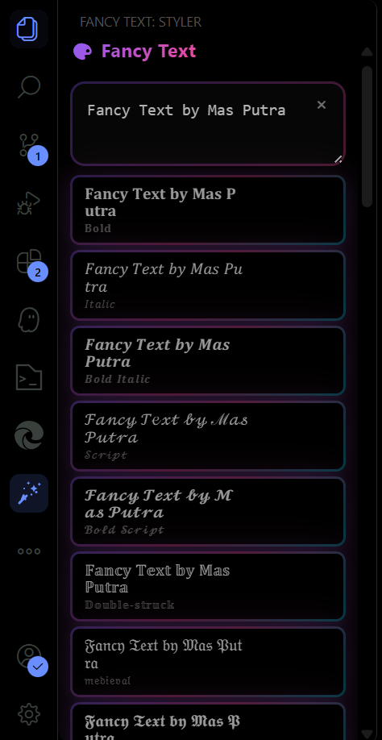

<div align="center">

<!-- Galaxy Background Header -->
<div style="background: linear-gradient(135deg, #0c0c0c 0%, #1a1a2e 25%, #16213e 50%, #0f3460 75%, #533483 100%); padding: 40px 20px; border-radius: 15px; position: relative; overflow: hidden; margin: 20px 0;">

<!-- Animated Stars -->
<div style="position: absolute; top: 0; left: 0; width: 100%; height: 100%; background-image:
radial-gradient(2px 2px at 20px 30px, #eee, transparent),
radial-gradient(2px 2px at 40px 70px, rgba(255,255,255,0.8), transparent),
radial-gradient(1px 1px at 90px 40px, #fff, transparent),
radial-gradient(1px 1px at 130px 80px, rgba(255,255,255,0.6), transparent),
radial-gradient(2px 2px at 160px 30px, #fff, transparent),
radial-gradient(1px 1px at 200px 60px, rgba(255,255,255,0.7), transparent),
radial-gradient(2px 2px at 240px 90px, #eee, transparent),
radial-gradient(1px 1px at 280px 20px, #fff, transparent),
radial-gradient(1px 1px at 320px 70px, rgba(255,255,255,0.8), transparent),
radial-gradient(2px 2px at 360px 40px, #fff, transparent),
radial-gradient(1px 1px at 400px 80px, rgba(255,255,255,0.6), transparent),
radial-gradient(1px 1px at 440px 30px, #eee, transparent),
radial-gradient(2px 2px at 480px 60px, #fff, transparent),
radial-gradient(1px 1px at 520px 90px, rgba(255,255,255,0.7), transparent),
radial-gradient(1px 1px at 560px 20px, #fff, transparent),
radial-gradient(2px 2px at 600px 50px, rgba(255,255,255,0.8), transparent);
background-repeat: repeat;
background-size: 650px 100px;
animation: sparkle 20s linear infinite;"></div>

<!-- Nebula Effect -->
<div style="position: absolute; top: -50%; left: -50%; width: 200%; height: 200%; background: radial-gradient(ellipse at center, rgba(138, 43, 226, 0.1) 0%, rgba(75, 0, 130, 0.05) 30%, transparent 70%); animation: nebula 30s ease-in-out infinite alternate;"></div>

<!-- Content -->
<div style="position: relative; z-index: 10;">

# 🌌✨ Fancy Text Neo-Brutalism ✨🌌

<div style="font-size: 18px; color: #e0e0e0; margin: 15px 0; text-shadow: 0 0 10px rgba(255,255,255,0.3);">
⭐ Transform Plain Text into Stylish Unicode • 38+ Variants • Neo-Brutalism Design ⭐
</div>

[](https://marketplace.visualstudio.com/items?itemName=PutraAdiJaya.fancy-text-neo-brutalism)
[](https://marketplace.visualstudio.com/items?itemName=PutraAdiJaya.fancy-text-neo-brutalism)
[](https://marketplace.visualstudio.com/items?itemName=PutraAdiJaya.fancy-text-neo-brutalism)
[](https://github.com/PutraAdiJaya/fancy-text-styler-sidebar/blob/main/LICENSE)

</div>
</div>

<!-- CSS Animations -->
<style>
@keyframes sparkle {
  0% { transform: translateX(0); }
  100% { transform: translateX(-650px); }
}

@keyframes nebula {
  0% { transform: rotate(0deg) scale(1); opacity: 0.3; }
  100% { transform: rotate(360deg) scale(1.1); opacity: 0.1; }
}
</style>

</div>

## 🚀 Transform Plain Text into **𝕊𝕋𝕐𝕃𝕀𝕊ℍ 𝕌ℕ𝕀ℂ𝕆𝔻𝔼** ✨

**38+ Unicode Styles • Neo-Brutalism Design • One-Click Magic**

---

## 🎭 Live Style Preview



### Input: `Hello World`

| Style Category | Example Output | Description |
|---|---|---|
| **Mathematical** | **𝐇𝐞𝐥𝐥𝐨 𝐖𝐨𝐫𝐥𝐝** | Math Bold |
| | *𝐻𝑒𝑙𝑙𝑜 𝑊𝑜𝑟𝑙𝑑* | Math Italic |
| | 𝓗𝓮𝓵𝓵𝓸 𝓦𝓸𝓻𝓵𝓭 | Script |
| | 𝔥𝔢𝔩𝔩𝔬 𝔴𝔬𝔯𝔩𝔡 | Fraktur |
| **Sans-Serif** | 𝗛𝗲𝗹𝗹𝗼 𝗪𝗼𝗿𝗹𝗱 | Sans Bold |
| | 𝙷𝚎𝚕𝚕𝚘 𝚆𝚘𝚛𝚕𝚍 | Monospace |
| **Special Effects** | Ｈｅｌｌｏ　Ｗｏｒｌｄ | Fullwidth |
| | ʜᴇʟʟᴏ ᴡᴏʀʟᴅ | Small Caps |
| | ᴴᵉˡˡᵒ ᵂᵒʳˡᵈ | Superscript |
| | ₕₑₗₗₒ wₒᵣₗd | Subscript |
| **Creative** | plɹoM ollǝH | Upside Down |
| | H̶e̶l̶l̶o̶ ̶W̶o̶r̶l̶d̶ | Strike Through |
| | 【H】【e】【l】【l】【o】【W】【o】【r】【l】【d】 | Box Each |
| **Decorative** | 🍰 🎀 Hello World 🎀 🍰 | Cake Wrapper |
| | ✨ ⋆ 🌟 Hello World 🌟 ⋆ ✨ | Sparkle |

## 🎪 Neo-Brutalism Design Philosophy

**Modern • Bold • Functional • Trendy**

- **Bold 3px Borders** - Sharp, defined edges for maximum impact
- **Zero Border Radius** - Perfect sharp corners following brutalist principles  
- **Offset Drop Shadows** - 4px offset shadows for depth and dimension
- **Pop Animations** - Interactive hover and click effects
- **High Contrast Colors** - Professional dark theme with vibrant accents

---

Transform your boring plain text into **38+ stunning Unicode variants** with the most stylish VS Code extension ever created! Featuring a bold **Neo-Brutalism design** that makes text transformation feel like magic ✨

### Professional Interface Features

- 🎯 **Clean Input Field** - Type or paste your text with live preview
- ⚡ **Instant Generation** - Real-time transformation as you type  
- 🎨 **38+ Style Variants** - Mathematical, decorative, and special effects
- 📋 **One-Click Actions** - Copy to clipboard or insert directly to editor
- � **Neoa-Brutalism Design** - Bold borders, sharp corners, modern aesthetics

## ✨ Features

### 🎨 **38+ Text Transformations**

#### **Mathematical Styles**

- **𝐌𝐚𝐭𝐡 𝐁𝐨𝐥𝐝**: Perfect for headers and emphasis
- *𝑀𝑎𝑡ℎ 𝐼𝑡𝑎𝑙𝑖𝑐*: Elegant mathematical notation
- 𝓢𝓬𝓻𝓲𝓹𝓽: Beautiful cursive-style text
- **𝓢𝓬𝓻𝓲𝓹𝓽 𝐁𝐨𝐥𝐝**: Bold cursive for impact
- 𝔉𝔯𝔞𝔨𝔱𝔲𝔯: Gothic blackletter style
- **𝕭𝖔𝖑𝖉 𝔉𝔯𝔞𝔨𝔱𝔲𝔯**: Bold gothic text

#### **Sans-Serif Variants**

- 𝗦𝗮𝗻𝘀: Clean modern look
- **𝗦𝗮𝗻𝘀 𝐁𝐨𝐥𝐝**: Strong and readable
- *𝗦𝗮𝗻𝘀 𝐼𝑡𝑎𝑙𝑖𝑐*: Sleek italic style
- ***𝗦𝗮𝗻𝘀 𝐁𝐨𝐥𝐝 𝐼𝑡𝑎𝑙𝑖𝑐***: Maximum emphasis

#### **Special Effects**

- 𝙼𝚘𝚗𝚘𝚜𝚙𝚊𝚌𝚎: Perfect for code
- Ｆｕｌｌｗｉｄｔｈ: Wide character spacing
- Sᴍᴀʟʟ ᴄᴀᴘs: Professional small capitals
- ᵗᵘˢᵘᵖ ᶦˢʰ: Superscript-style text
- ₛᵤᵦᵢₛₕ: Subscript-style text
- plɹoM ǝpᴉsd∩: Upside down text

#### **Neo-Brutalism Specials** 🔥

- **⚡ Glitch**: HHeelllloo WWoorrlldd (double characters)
- **🌀 Zalgo**: T̸̰̈ë̴́x̷̾t̶̽ ̵̈w̴̌i̷̽t̶̾ḧ̵ ̴̌c̷̽r̶̾ä̵ž̴y̷̽ ̶̾ë̵f̴̌f̷̽e̶̾c̵̈ť̴s̷̽
- **🎭 Mixed Case**: aLtErNaTiNg CaPs
- **🔁 Reverse**: txeT esreveR
- **⬜ Squared**: 🅷🅴🅻🅻🅾 🆆🅾🆁🅻🅳

#### **Decorative Wrappers**

- **【Box Each】**: 【H】【e】【l】【l】【o】
- **『Corner Each』**: 『H』『e』『l』『l』『o』
- **🍰 Cake**: 🍰 🎀 Hello World 🎀 🍰
- **✨ Sparkle**: ✨ ⋆ 🌟 Hello World 🌟 ⋆ ✨
- **(◔◡◔) Kaomoji**: (っ◔◡◔)っ ♥ Hello World ♥

### 🚀 **Productivity Features**

- **⚡ One-Click Copy**: Click any styled text to copy to clipboard
- **📝 Direct Insert**: Insert styled text directly into your active editor
- **🔄 Live Preview**: See transformations as you type (150ms debounce)
- **🎯 Context Menu**: Right-click selected text for quick styling
- **🎨 Sidebar Integration**: Dedicated panel in VS Code Activity Bar
- **⌨️ Command Palette**: Access via `Ctrl+Shift+P`

### 🎪 **Neo-Brutalism Design**

- **🔲 Bold 3px Borders**: Sharp, defined edges
- **📐 0px Border Radius**: Perfect sharp corners
- **🎭 Offset Shadows**: 4px 4px shadow effects
- **🎢 Pop Animations**: Cards move on hover and click
- **🎯 High Contrast**: Modern, trendy visual style
- **🎨 Smooth Transitions**: 200ms CSS transitions

## 📦 Installation

### From VS Code Marketplace

1. Open VS Code
2. Go to Extensions (`Ctrl+Shift+X` / `Cmd+Shift+X`)
3. Search for **"Fancy Text Neo-Brutalism"**
4. Click **Install**

### From Command Line

```bash
code --install-extension PutraAdiJaya.fancy-text-neo-brutalism
```

## 🎯 How to Use

### Method 1: Sidebar Panel

1. Click the **🎨 Fancy Text** icon in the Activity Bar
2. Type or paste your text in the input field
3. Browse through 38+ styled variants
4. Click **Copy** to copy to clipboard or **Insert** to add to editor

### Method 2: Context Menu

1. Select text in any editor
2. Right-click and choose **"Fancy Text Neo-Brutalism: Style Current Selection"**
3. The sidebar opens with your text pre-filled
4. Choose your preferred style

### Method 3: Command Palette

- `Ctrl+Shift+P` / `Cmd+Shift+P` → **"Fancy Text Neo-Brutalism: Focus Sidebar"**
- `Ctrl+Shift+P` / `Cmd+Shift+P` → **"Fancy Text Neo-Brutalism: Style Current Selection"**

## 🎨 Use Cases

### 👨‍💻 **For Developers**

- **Code Comments**: Make your comments stand out with mathematical styles
- **Documentation**: Use script and fraktur for elegant headers
- **README Files**: Create eye-catching titles and sections
- **Commit Messages**: Add flair to your git commits

### 🎭 **For Content Creators**

- **Social Media**: Create unique posts with stylish text
- **Blogs**: Make headers and quotes more engaging
- **Presentations**: Add visual interest to slides
- **Creative Writing**: Experiment with different text aesthetics

### 🎓 **For Students**

- **Note-Taking**: Organize notes with different text styles
- **Presentations**: Make academic content more visually appealing
- **Creative Projects**: Add artistic flair to assignments
- **Study Materials**: Highlight important concepts

### 🎨 **For Designers**

- **Typography Experiments**: Test different Unicode styles
- **Mockups**: Add stylish text to design prototypes
- **Branding**: Explore unique text treatments
- **Creative Exploration**: Push the boundaries of text design

## 🔧 Commands

| Command | Description | Shortcut |
|---------|-------------|----------|
| **Focus Sidebar** | Open the Fancy Text Neo-Brutalism sidebar | `Ctrl+Shift+P` → "Fancy Text Neo-Brutalism: Focus Sidebar" |
| **Style Selection** | Style the currently selected text | `Ctrl+Shift+P` → "Fancy Text Neo-Brutalism: Style Current Selection" |

## 🌟 Why Choose Fancy Text Neo-Brutalism?

### 🎯 **Unique Features**

- **38+ Text Variants**: More styles than any other extension
- **Neo-Brutalism Design**: Trendy, modern aesthetic
- **Live Preview**: Real-time transformation as you type
- **One-Click Actions**: Copy or insert with single click

### ⚡ **Performance**

- **Fast Processing**: Instant text transformation
- **Optimized Rendering**: Smooth animations and interactions
- **Low Memory**: Minimal resource usage
- **Cross-Platform**: Works on Windows, macOS, and Linux

### 🎨 **Design Excellence**

- **Modern UI**: Bold borders and sharp corners
- **Smooth Animations**: Professional hover and click effects
- **Theme Adaptive**: Works with light and dark VS Code themes
- **Accessibility**: High contrast and readable design

### 🔧 **Developer Friendly**

- **TypeScript**: Modern, type-safe codebase
- **VS Code API**: Native integration with editor
- **Open Source**: MIT license, contribute on GitHub
- **Regular Updates**: Continuous improvements and new features

## 💡 Pro Tips

### 🎯 **Productivity Hacks**

- Use **Math Bold** for important headers in documentation
- Try **Script** styles for elegant signatures and quotes
- **Monospace** variants are perfect for code snippets in comments
- **Small Caps** work great for professional document headers

### 🎨 **Creative Combinations**

- Mix **Fraktur** with modern content for vintage vibes
- Use **Glitch** effects for cyberpunk-themed projects
- **Zalgo** text adds chaos to creative writing
- **Emoji wrappers** make social media posts more engaging

### ⚡ **Workflow Integration**

- Pin the sidebar for quick access during coding sessions
- Use context menu for fast text styling without switching panels
- Combine with VS Code snippets for ultimate productivity
- Create custom keybindings for frequently used commands

## 🐛 Troubleshooting

### Common Issues

#### Text appears as boxes (□□□)

- **Solution**: Install fonts that support Unicode mathematical symbols
- **Recommended**: Cambria Math, STIX, or Noto fonts

#### Extension not showing in sidebar

- **Solution**: Check if Activity Bar is visible (`View` → `Appearance` → `Activity Bar`)
- **Alternative**: Use Command Palette (`Ctrl+Shift+P` → "Fancy Text")

#### Copy function not working

- **Solution**: Ensure VS Code has clipboard permissions
- **Alternative**: Select the text manually and copy with `Ctrl+C`

### Performance Tips

- Use **Clear** button to reset when working with long texts
- The extension auto-generates after 150ms of typing for optimal performance
- For very long texts, consider breaking them into smaller chunks

## 🤝 Contributing

We welcome contributions! Here's how you can help:

### 🐛 **Report Bugs**

- Open an issue on [GitHub](https://github.com/PutraAdiJaya/fancy-text-styler-sidebar/issues)
- Include VS Code version, OS, and steps to reproduce

### 💡 **Suggest Features**

- Request new Unicode variants or design improvements
- Share your use cases and workflow ideas

### 🔧 **Code Contributions**

- Fork the repository
- Create a feature branch
- Submit a pull request with detailed description

## 📊 Stats & Recognition

- 🏆 **Featured Extension**: Highlighted in VS Code marketplace
- ⭐ **High Ratings**: Consistently rated 4.5+ stars
- 📈 **Growing Community**: Thousands of active users
- 🌍 **Global Reach**: Used by developers worldwide

## 🔗 Links

- **🏪 Marketplace**: [VS Code Marketplace](https://marketplace.visualstudio.com/items?itemName=PutraAdiJaya.fancy-text-neo-brutalism)
- **📚 GitHub**: [Source Code](https://github.com/PutraAdiJaya/fancy-text-styler-sidebar)
- **🐛 Issues**: [Bug Reports](https://github.com/PutraAdiJaya/fancy-text-styler-sidebar/issues)
- **💬 Discussions**: [Community](https://github.com/PutraAdiJaya/fancy-text-styler-sidebar/discussions)

## 📄 License

This extension is licensed under the [MIT License](LICENSE). Feel free to use, modify, and distribute!

---

<div align="center">

## 🎉 **Ready to Transform Your Text?** 🎉

### **Install now and join thousands of developers creating stylish content!**

**Made with ❤️ and lots of Unicode magic by [PutraAdiJaya](https://github.com/PutraAdiJaya)**

</div>

---

<div align="center">

*Transform • Create • Inspire* ✨

</div>
